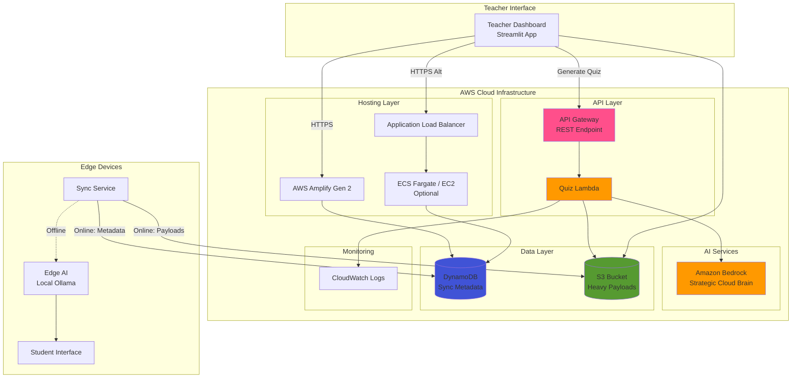
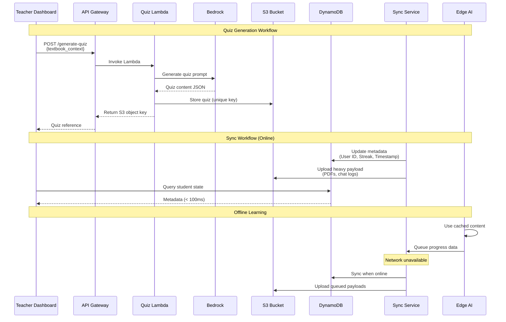

# Design Document: AWS Infrastructure Elevation

## Overview

This design elevates the StudAxis EdTech platform from Phase 2 to MVP-ready infrastructure for hackathon submission. The system implements a Dual-Brain Architecture where Amazon Bedrock (Strategic Cloud Brain) generates curriculum content while local Ollama (Edge AI) provides offline tutoring. This elevation introduces four key infrastructure components:

1. **DynamoDB State Store**: Lightweight sync metadata storage (User ID, Current Streak, Last Sync Timestamp)
2. **AWS Amplify Dashboard Hosting**: Cloud-hosted Teacher Dashboard with HTTPS access
3. **API Gateway + Lambda Quiz Generation**: Serverless workflow for AI-generated assessments
4. **Optional ECS/EC2 Deployment**: Containerized dashboard alternative for Streamlit applications

The design maintains the core principle of connectivity-independent learning: students can continue education offline after initial sync, while teachers access cloud-hosted dashboards to manage content and view analytics. Data separation between DynamoDB (fast metadata queries) and S3 (heavy payloads) ensures cost-efficient operations at scale.

## Architecture

### High-Level System Architecture



### Deployment Architecture Options

The system supports two deployment patterns for the Teacher Dashboard:

**Option A: AWS Amplify Static Hosting**
- Suitable for React-wrapped Streamlit or static dashboard builds
- Amplify Gen 2 serves static assets via CloudFront CDN
- Direct integration with DynamoDB via IAM-authenticated API calls
- Lowest operational overhead and cost

**Option B: Containerized Deployment (ECS/EC2)**
- Required for native Streamlit applications needing Python runtime
- ECS Fargate (serverless containers) or EC2 (t3.small/micro instances)
- Application Load Balancer provides HTTPS termination
- IAM roles grant container access to DynamoDB and S3

### Data Flow Architecture



## Components and Interfaces

### 1. DynamoDB State Store

**Table Schema:**
```
Table Name: studaxis-student-sync
Partition Key: user_id (String)
Attributes:
  - current_streak (Number)
  - last_sync_timestamp (String, ISO 8601 format)
  - sync_status (String: "synced" | "pending" | "error")
  - device_id (String, optional)
  
Capacity Mode: On-Demand (pay-per-request)
Point-in-Time Recovery: Enabled
Encryption: AWS-managed keys
```

**Access Patterns:**
- Query by user_id: Teacher Dashboard retrieves student state
- Update by user_id: Sync Service writes metadata after synchronization
- Scan with filter: Dashboard analytics aggregate streak data

**Performance Requirements:**
- Read latency: < 100ms (single-digit milliseconds typical)
- Write latency: < 50ms
- Consistency: Eventually consistent reads acceptable for dashboard queries

### 2. S3 Payload Store

**Bucket Structure:**
```
studaxis-payloads/
├── quizzes/
│   └── {quiz_id}.json
├── textbooks/
│   └── {textbook_id}.pdf
└── chat_logs/
    └── {user_id}/
        └── {session_id}.jsonl
```

**Bucket Configuration:**
- Versioning: Enabled for quiz and textbook content
- Lifecycle Policy: Transition chat logs to S3 Glacier after 90 days
- Encryption: SSE-S3 (AES-256)
- CORS: Enabled for dashboard pre-signed URL access

**Access Patterns:**
- Quiz Lambda: PutObject for generated quizzes
- Sync Service: PutObject for chat logs and progress data
- Teacher Dashboard: GetObject via pre-signed URLs (time-limited)

### 3. API Gateway Quiz Endpoint

**Endpoint Configuration:**
```
Type: REST API
Resource: /generate-quiz
Method: POST
Authorization: IAM (AWS_IAM)
Request Validation: Enabled

Request Schema:
{
  "textbook_id": "string",
  "topic": "string",
  "difficulty": "easy" | "medium" | "hard",
  "num_questions": number (1-20)
}

Response Schema (Success):
{
  "quiz_id": "string",
  "s3_key": "string",
  "s3_url": "string (pre-signed, 1 hour expiry)"
}

Response Schema (Error):
{
  "error": "string",
  "message": "string"
}
```

**Throttling:**
- Rate: 10 requests per second per teacher
- Burst: 20 requests
- Quota: 1000 requests per day per teacher

**Integration:**
- Type: Lambda Proxy Integration
- Timeout: 30 seconds
- Retry: 0 (quiz generation is idempotent via quiz_id)

### 4. Quiz Lambda Function

**Runtime Configuration:**
```
Runtime: Python 3.11
Memory: 512 MB
Timeout: 30 seconds
Architecture: arm64 (Graviton2 for cost efficiency)
```

**Environment Variables:**
```
BEDROCK_MODEL_ID: amazon.neo-lite-v2
S3_BUCKET_NAME: studaxis-payloads
DYNAMODB_TABLE_NAME: studaxis-student-sync
LOG_LEVEL: INFO
```

**IAM Permissions:**
- bedrock:InvokeModel (for quiz generation)
- s3:PutObject (for storing quizzes)
- logs:CreateLogGroup, logs:CreateLogStream, logs:PutLogEvents
- dynamodb:PutItem (optional: log generation metadata)

**Function Logic:**
1. Validate request payload (textbook_id, topic, difficulty, num_questions)
2. Retrieve textbook context from S3 (if not provided in request)
3. Construct Bedrock prompt with pedagogical instructions
4. Invoke Bedrock with streaming disabled (wait for complete response)
5. Parse and validate quiz JSON structure
6. Generate unique quiz_id (UUID v4)
7. Store quiz to S3 at `quizzes/{quiz_id}.json`
8. Generate pre-signed URL (1 hour expiry)
9. Return response with quiz_id, s3_key, s3_url
10. Log all steps to CloudWatch with correlation ID

**Error Handling:**
- Bedrock throttling: Return 429 with retry-after header
- Bedrock validation error: Return 400 with error details
- S3 write failure: Return 500 with generic error (log details)
- Timeout: Return 504 Gateway Timeout

### 5. Teacher Dashboard Hosting

**Amplify Gen 2 Configuration (Option A):**
```yaml
# amplify.yml
version: 1
frontend:
  phases:
    preBuild:
      commands:
        - npm ci
    build:
      commands:
        - npm run build
  artifacts:
    baseDirectory: build
    files:
      - '**/*'
  cache:
    paths:
      - node_modules/**/*

environment:
  REACT_APP_API_GATEWAY_URL: ${API_GATEWAY_URL}
  REACT_APP_DYNAMODB_TABLE: studaxis-student-sync
  REACT_APP_S3_BUCKET: studaxis-payloads
```

**ECS Fargate Configuration (Option B):**
```yaml
# Task Definition
Family: teacher-dashboard
NetworkMode: awsvpc
RequiresCompatibilities: [FARGATE]
Cpu: 512
Memory: 1024

ContainerDefinitions:
  - Name: streamlit-dashboard
    Image: {account}.dkr.ecr.{region}.amazonaws.com/teacher-dashboard:latest
    PortMappings:
      - ContainerPort: 8501
        Protocol: tcp
    Environment:
      - Name: DYNAMODB_TABLE
        Value: studaxis-student-sync
      - Name: S3_BUCKET
        Value: studaxis-payloads
    LogConfiguration:
      LogDriver: awslogs
      Options:
        awslogs-group: /ecs/teacher-dashboard
        awslogs-region: us-east-1
        awslogs-stream-prefix: ecs

TaskRoleArn: arn:aws:iam::{account}:role/ECSTaskRole
ExecutionRoleArn: arn:aws:iam::{account}:role/ECSExecutionRole
```

**ALB Configuration (Option B):**
- Scheme: Internet-facing
- Listeners: HTTPS:443 (ACM certificate required)
- Target Group: IP targets, port 8501, health check `/healthz`
- Security Group: Allow 443 from 0.0.0.0/0, allow 8501 from ALB SG

### 6. Sync Service Integration

**Component Responsibilities:**
- Runs on edge devices (student laptops)
- Detects network connectivity state
- Queues progress data during offline periods
- Uploads metadata to DynamoDB and payloads to S3 when online

**Atomic Sync Strategy:**
```python
def sync_student_progress(user_id, streak, payload_data):
    """
    Atomically sync metadata and payload with retry logic.
    """
    try:
        # Step 1: Upload payload to S3 first (idempotent)
        s3_key = f"chat_logs/{user_id}/{uuid.uuid4()}.jsonl"
        s3_client.put_object(
            Bucket="studaxis-payloads",
            Key=s3_key,
            Body=payload_data
        )
        
        # Step 2: Update DynamoDB with S3 reference
        dynamodb_client.put_item(
            TableName="studaxis-student-sync",
            Item={
                "user_id": user_id,
                "current_streak": streak,
                "last_sync_timestamp": datetime.utcnow().isoformat(),
                "sync_status": "synced",
                "last_payload_key": s3_key
            }
        )
        
        return {"status": "success", "s3_key": s3_key}
        
    except S3Error as e:
        log.error(f"S3 upload failed: {e}")
        return {"status": "error", "reason": "s3_failure"}
        
    except DynamoDBError as e:
        log.error(f"DynamoDB update failed: {e}")
        # Payload is in S3 but metadata not updated
        # Retry logic will re-attempt DynamoDB write
        return {"status": "error", "reason": "dynamodb_failure"}
```

**Retry Logic:**
- S3 upload: Exponential backoff, max 3 retries
- DynamoDB write: Exponential backoff, max 5 retries
- If DynamoDB write fails after S3 success: Mark sync_status as "pending" and retry on next sync cycle
- Idempotency: Use deterministic s3_key based on user_id + timestamp to prevent duplicates

## Data Models

### DynamoDB Item Structure

```json
{
  "user_id": "student_12345",
  "current_streak": 7,
  "last_sync_timestamp": "2024-01-15T14:30:00Z",
  "sync_status": "synced",
  "device_id": "laptop_abc123",
  "last_payload_key": "chat_logs/student_12345/session_xyz.jsonl",
  "total_sessions": 42,
  "last_quiz_score": 85
}
```

**Attribute Descriptions:**
- `user_id` (String, PK): Unique student identifier
- `current_streak` (Number): Consecutive days of learning activity
- `last_sync_timestamp` (String): ISO 8601 UTC timestamp of last successful sync
- `sync_status` (String): Current sync state ("synced", "pending", "error")
- `device_id` (String): Identifier for student's edge device
- `last_payload_key` (String): S3 key reference to most recent heavy payload
- `total_sessions` (Number): Cumulative count of learning sessions
- `last_quiz_score` (Number): Most recent quiz performance (0-100)

### S3 Quiz Object Structure

```json
{
  "quiz_id": "quiz_a1b2c3d4",
  "textbook_id": "physics_grade10",
  "topic": "Newton's Laws of Motion",
  "difficulty": "medium",
  "generated_at": "2024-01-15T14:30:00Z",
  "questions": [
    {
      "question_id": "q1",
      "type": "multiple_choice",
      "text": "What is Newton's First Law of Motion?",
      "options": [
        "An object at rest stays at rest unless acted upon by a force",
        "Force equals mass times acceleration",
        "For every action there is an equal and opposite reaction",
        "Energy cannot be created or destroyed"
      ],
      "correct_answer": 0,
      "explanation": "Newton's First Law states that an object will remain at rest or in uniform motion unless acted upon by an external force."
    },
    {
      "question_id": "q2",
      "type": "free_response",
      "text": "Explain why a passenger feels pushed back into their seat when a car accelerates.",
      "rubric": "Answer should mention inertia, Newton's First Law, and the tendency of the body to remain at rest while the car accelerates forward.",
      "sample_answer": "Due to inertia (Newton's First Law), the passenger's body tends to remain at rest while the car accelerates forward. The seat pushes the passenger forward, creating the sensation of being pushed back."
    }
  ],
  "metadata": {
    "model": "amazon.neo-lite-v2",
    "generation_time_ms": 3421,
    "teacher_id": "teacher_789"
  }
}
```

### S3 Chat Log Structure

```jsonl
{"timestamp": "2024-01-15T14:30:00Z", "user_id": "student_12345", "role": "student", "message": "Can you explain photosynthesis?"}
{"timestamp": "2024-01-15T14:30:05Z", "user_id": "student_12345", "role": "assistant", "message": "Photosynthesis is the process by which plants convert light energy into chemical energy..."}
{"timestamp": "2024-01-15T14:31:20Z", "user_id": "student_12345", "role": "student", "message": "What role does chlorophyll play?"}
{"timestamp": "2024-01-15T14:31:28Z", "user_id": "student_12345", "role": "assistant", "message": "Chlorophyll is the green pigment in plants that absorbs light energy..."}
```

**Format:** JSON Lines (one JSON object per line)
**Compression:** Gzip before upload to S3
**Retention:** 90 days in S3 Standard, then transition to Glacier

### API Gateway Request/Response Models

**Generate Quiz Request:**
```json
{
  "textbook_id": "physics_grade10",
  "topic": "Newton's Laws of Motion",
  "difficulty": "medium",
  "num_questions": 5
}
```

**Generate Quiz Response (Success):**
```json
{
  "quiz_id": "quiz_a1b2c3d4",
  "s3_key": "quizzes/quiz_a1b2c3d4.json",
  "s3_url": "https://studaxis-payloads.s3.amazonaws.com/quizzes/quiz_a1b2c3d4.json?X-Amz-Algorithm=...",
  "expires_at": "2024-01-15T15:30:00Z"
}
```

**Generate Quiz Response (Error):**
```json
{
  "error": "ValidationError",
  "message": "num_questions must be between 1 and 20"
}
```


## Correctness Properties

*A property is a characteristic or behavior that should hold true across all valid executions of a system—essentially, a formal statement about what the system should do. Properties serve as the bridge between human-readable specifications and machine-verifiable correctness guarantees.*

### Property Reflection

After analyzing all acceptance criteria, I identified the following redundancies and consolidations:

**Redundancy Analysis:**
- Properties 1.2 and 1.3 (attribute type validation) can be combined into a single schema validation property
- Properties 1.4 and 4.3 both test sync operations writing to DynamoDB - these overlap significantly
- Properties 3.2, 3.3, 3.4 form a workflow chain that can be tested as a single end-to-end property
- Properties 4.1 and 4.2 (data routing by size) can be combined into a single data separation property
- Properties 7.1, 7.2, 7.3, 7.4, 7.5, 7.6, 7.7 describe the complete quiz generation workflow - better tested as integrated workflow properties rather than individual steps
- Properties 8.3 and 8.6 both test sync behavior when connectivity is restored - these can be combined

**Consolidated Properties:**
After reflection, I've consolidated 40+ testable criteria into 15 unique, non-redundant properties that provide comprehensive validation coverage.

### Property 1: DynamoDB Schema Validation

*For any* sync metadata record written to DynamoDB, the record must contain user_id as the partition key, current_streak as a Number type, and last_sync_timestamp as a String in ISO 8601 format.

**Validates: Requirements 1.1, 1.2, 1.3**

### Property 2: Sync Atomicity with Retry

*For any* sync operation, if the S3 payload write succeeds but the DynamoDB metadata write fails, the system must retry the DynamoDB write with exponential backoff until success or mark the sync_status as "pending" for the next sync cycle.

**Validates: Requirements 1.7**

### Property 3: Metadata Query Performance

*For any* student state query from the Teacher Dashboard, the DynamoDB read operation must complete within 100ms under normal load conditions.

**Validates: Requirements 1.6**

### Property 4: HTTPS Endpoint Enforcement

*For any* dashboard access URL, the protocol must be HTTPS (not HTTP).

**Validates: Requirements 2.5**

### Property 5: Dashboard Response Time

*For any* teacher accessing the dashboard URL, the initial page load must complete within 2 seconds under normal network conditions.

**Validates: Requirements 2.4**

### Property 6: Quiz Generation End-to-End Workflow

*For any* valid quiz generation request, the complete workflow (API Gateway → Lambda → Bedrock → S3 → Response) must return an S3 object key within 30 seconds, and the quiz content must be retrievable from S3 using that key.

**Validates: Requirements 3.2, 3.3, 3.4, 3.5, 7.6, 7.7**

### Property 7: Quiz Generation Error Handling

*For any* quiz generation request where Bedrock fails to generate content, the Quiz Lambda must return an HTTP 500 status code with a descriptive error message and log the failure to CloudWatch.

**Validates: Requirements 3.6, 7.8**

### Property 8: API Gateway Authentication

*For any* quiz generation request without valid IAM credentials, the API Gateway must reject the request with HTTP 403 Forbidden before invoking the Lambda function.

**Validates: Requirements 3.7**

### Property 9: Data Separation by Size

*For any* sync operation, metadata records smaller than 4KB must be stored in DynamoDB, while payloads larger than 4KB must be stored in S3 with only a reference key in DynamoDB.

**Validates: Requirements 4.1, 4.2, 4.3**

### Property 10: Metadata-Only Query Optimization

*For any* Teacher Dashboard query for student state metadata, the query must retrieve data from DynamoDB without making any S3 API calls.

**Validates: Requirements 4.4**

### Property 11: Payload Access via Reference

*For any* Teacher Dashboard request for heavy payload content, the dashboard must use the S3 reference key stored in DynamoDB to fetch the payload from S3.

**Validates: Requirements 4.5**

### Property 12: Quiz Lambda Logging

*For any* quiz generation request, the Quiz Lambda must log the request details, Bedrock invocation, and S3 storage operation to CloudWatch with a correlation ID linking all log entries.

**Validates: Requirements 7.3**

### Property 13: Bedrock Prompt Context Inclusion

*For any* quiz generation request, the prompt sent to Bedrock must include the textbook context specified in the request payload.

**Validates: Requirements 7.4**

### Property 14: Quiz Response Format Validation

*For any* quiz content returned by Bedrock, the Quiz Lambda must validate that the response conforms to the expected JSON schema (quiz_id, questions array, metadata) before storing to S3.

**Validates: Requirements 7.5**

### Property 15: Offline Learning Continuity

*For any* student device with cached content, the Edge AI must continue providing tutoring capabilities without network connectivity, and when connectivity is restored, the Sync Service must upload all accumulated progress data to DynamoDB and S3.

**Validates: Requirements 8.1, 8.2, 8.4, 8.3, 8.6**

### Property 16: S3 Object Key Uniqueness

*For any* two quiz generation requests, the generated S3 object keys must be unique to prevent overwriting existing quizzes.

**Validates: Requirements 7.6**

### Property 17: Cloud Content Generation Connectivity Requirement

*For any* content generation request to the Strategic Cloud Brain (Bedrock), the operation must fail gracefully with a connectivity error if network access is unavailable.

**Validates: Requirements 8.5**

## Error Handling

### DynamoDB Error Scenarios

**Throttling (ProvisionedThroughputExceededException):**
- Response: Implement exponential backoff with jitter
- Retry: Up to 5 attempts with delays: 100ms, 200ms, 400ms, 800ms, 1600ms
- Fallback: If all retries fail, mark sync_status as "error" and queue for next sync cycle
- User Impact: Teacher Dashboard shows "Sync pending" status

**Item Not Found:**
- Response: Return empty state with default values (streak = 0, last_sync = null)
- Logging: Log as INFO (not ERROR) since this is expected for new users
- User Impact: Dashboard displays "No sync data available"

**Validation Error (Invalid Attribute Type):**
- Response: Reject write operation immediately
- Logging: Log as ERROR with full item details
- User Impact: Sync fails with error message to user

### S3 Error Scenarios

**Access Denied (403):**
- Response: Check IAM role permissions
- Logging: Log as CRITICAL with role ARN and requested operation
- Retry: No retry (permission issue requires manual fix)
- User Impact: Quiz generation fails with "Permission error"

**Object Not Found (404):**
- Response: Return error to client
- Logging: Log as WARNING (may indicate deleted content)
- User Impact: Dashboard shows "Content not available"

**Slow Upload (Timeout):**
- Response: Increase Lambda timeout to 30 seconds
- Retry: Single retry with exponential backoff
- Fallback: If retry fails, return 504 Gateway Timeout
- User Impact: User sees "Request timed out, please try again"

### Bedrock Error Scenarios

**Throttling (ThrottlingException):**
- Response: Return HTTP 429 with Retry-After header
- Retry: Client-side retry recommended after delay
- Logging: Log as WARNING with request details
- User Impact: Dashboard shows "Service busy, please retry in 30 seconds"

**Validation Error (ValidationException):**
- Response: Return HTTP 400 with error details
- Logging: Log as ERROR with prompt details
- User Impact: Dashboard shows "Invalid quiz parameters"

**Model Error (ModelErrorException):**
- Response: Return HTTP 500 with generic error message
- Logging: Log as ERROR with full Bedrock response
- Retry: No automatic retry (may indicate prompt issue)
- User Impact: Dashboard shows "Quiz generation failed"

**Content Filtering (ContentFilterException):**
- Response: Return HTTP 400 with content policy violation message
- Logging: Log as WARNING (expected for inappropriate content)
- User Impact: Dashboard shows "Content violates policy, please modify request"

### API Gateway Error Scenarios

**Invalid Request Payload:**
- Response: Return HTTP 400 with validation error details
- Validation: Check required fields (textbook_id, topic, difficulty, num_questions)
- User Impact: Dashboard shows field-specific error messages

**Authentication Failure:**
- Response: Return HTTP 403 Forbidden
- Logging: Log as WARNING with attempted credentials
- User Impact: Dashboard shows "Authentication required"

**Rate Limit Exceeded:**
- Response: Return HTTP 429 with Retry-After header
- Throttling: 10 req/sec per teacher, burst 20
- User Impact: Dashboard shows "Too many requests, please wait"

### Sync Service Error Scenarios

**Network Connectivity Loss During Sync:**
- Response: Queue pending operations locally
- Retry: Attempt sync every 5 minutes when connectivity detected
- Persistence: Store queued operations in local SQLite database
- User Impact: Edge AI continues working offline, sync resumes automatically

**Partial Sync Failure (S3 Success, DynamoDB Failure):**
- Response: Mark sync_status as "pending" in local queue
- Retry: Retry DynamoDB write on next sync cycle (S3 already has data)
- Idempotency: Use deterministic S3 keys to prevent duplicates
- User Impact: Dashboard may show stale data until next successful sync

**Corrupted Payload Data:**
- Response: Skip corrupted payload, log error, continue with next item
- Logging: Log as ERROR with payload hash and size
- User Impact: Specific session data may be missing from dashboard

## Testing Strategy

### Dual Testing Approach

This feature requires both unit testing and property-based testing for comprehensive coverage:

**Unit Tests** focus on:
- Specific examples of valid and invalid inputs
- Edge cases (empty payloads, maximum size limits, boundary conditions)
- Error conditions (network failures, permission errors, malformed data)
- Integration points between components (API Gateway → Lambda, Lambda → Bedrock)

**Property-Based Tests** focus on:
- Universal properties that hold across all inputs (schema validation, atomicity, performance)
- Randomized input generation to discover unexpected edge cases
- Workflow correctness across diverse scenarios

Both approaches are complementary: unit tests catch concrete bugs in specific scenarios, while property tests verify general correctness across the input space.

### Property-Based Testing Configuration

**Framework Selection:**
- Python: Hypothesis (for Lambda functions, Sync Service)
- TypeScript/JavaScript: fast-check (for dashboard frontend)
- Infrastructure: AWS CDK assertions for resource configuration

**Test Configuration:**
- Minimum iterations: 100 per property test
- Timeout: 60 seconds per test (to accommodate AWS API calls)
- Shrinking: Enabled (to find minimal failing examples)

**Tagging Convention:**
Each property-based test must include a comment referencing the design document property:

```python
# Feature: aws-infrastructure-elevation, Property 1: DynamoDB Schema Validation
@given(st.text(), st.integers(min_value=0), st.datetimes())
def test_dynamodb_schema_validation(user_id, streak, timestamp):
    record = create_sync_record(user_id, streak, timestamp)
    assert validate_dynamodb_schema(record)
```

### Unit Testing Strategy

**DynamoDB Integration Tests:**
- Test writing records with valid schema
- Test reading records with sub-100ms latency (using DynamoDB Local)
- Test handling throttling errors with retry logic
- Test atomic writes with S3 (mock S3 failures to verify retry)

**S3 Integration Tests:**
- Test uploading quiz content with unique keys
- Test generating pre-signed URLs with correct expiry
- Test handling access denied errors
- Test payload size limits (4KB threshold)

**Lambda Function Tests:**
- Test quiz generation with valid Bedrock responses (mocked)
- Test error handling for Bedrock failures
- Test CloudWatch logging with correlation IDs
- Test request validation (missing fields, invalid types)
- Test timeout handling (simulate slow Bedrock responses)

**API Gateway Tests:**
- Test authentication with valid/invalid IAM credentials
- Test request validation (schema enforcement)
- Test rate limiting (exceed 10 req/sec threshold)
- Test CORS configuration for dashboard access

**Sync Service Tests:**
- Test online sync (both DynamoDB and S3 writes succeed)
- Test partial failure (S3 succeeds, DynamoDB fails)
- Test offline queueing (network unavailable)
- Test sync recovery (connectivity restored after offline period)
- Test idempotency (duplicate sync operations)

**Dashboard Integration Tests:**
- Test metadata queries from DynamoDB (no S3 access)
- Test payload fetching from S3 (using reference keys)
- Test HTTPS endpoint enforcement
- Test page load performance (< 2 seconds)

### Performance Testing

**Load Testing Scenarios:**
- 100 concurrent teachers accessing dashboard
- 50 concurrent quiz generation requests
- 1000 student devices syncing simultaneously

**Performance Benchmarks:**
- DynamoDB read latency: < 100ms (p99)
- Dashboard page load: < 2 seconds (p95)
- Quiz generation: < 30 seconds (p95)
- S3 upload: < 5 seconds for 10MB payload (p95)

**Tools:**
- AWS CloudWatch Synthetics for dashboard availability monitoring
- Artillery or Locust for load testing API Gateway endpoints
- DynamoDB metrics for read/write latency tracking

### Integration Testing

**End-to-End Workflows:**
1. Teacher generates quiz → Bedrock creates content → Quiz stored in S3 → Dashboard displays quiz
2. Student completes session → Sync Service uploads to DynamoDB + S3 → Dashboard shows updated streak
3. Student goes offline → Edge AI continues tutoring → Connectivity restored → Sync uploads queued data

**Test Environment:**
- Use AWS CDK to deploy isolated test stack
- Use DynamoDB Local for fast unit tests
- Use LocalStack for S3 mocking in CI/CD
- Use Bedrock sandbox environment for integration tests

### Security Testing

**Authentication Tests:**
- Verify API Gateway rejects requests without IAM credentials
- Verify dashboard enforces HTTPS (redirect HTTP to HTTPS)
- Verify IAM roles have least-privilege permissions

**Data Protection Tests:**
- Verify S3 encryption at rest (SSE-S3)
- Verify DynamoDB encryption with AWS-managed keys
- Verify pre-signed URLs expire after 1 hour

**Penetration Testing:**
- Test SQL injection resistance (N/A for DynamoDB)
- Test XSS resistance in dashboard (sanitize user inputs)
- Test CSRF protection for quiz generation endpoint
